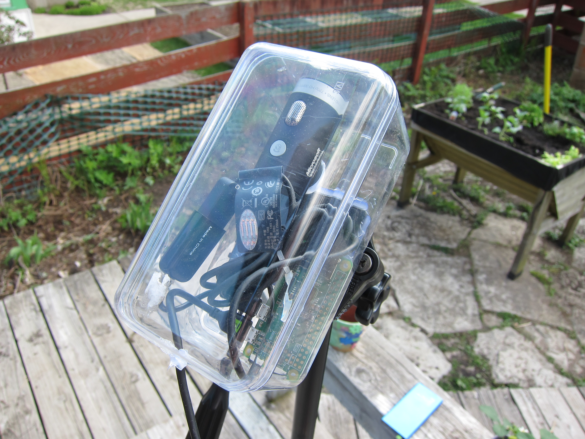

# SkyWatcher
**An automated aircraft annotation system for my backyard.. or anywhere really**

## Description
SkyWatcher is designed to do one thing: Automate the task of capturing aircraft images along with annotations. Why? Firstly, I live in the approach path to MSP. Secondly, I love airplanes, and lastly I really like exploring robotics, machine learning and computer vision topics. The end goal is to be able to build a detector/classifier someday that can reliably determine what type of aircraft is being observed through visual recognition alone. To do that I need a lot of training samples and although I'm no stranger to hand annotation (https://github.com/froohoo/Inference) I didn't really want to do that again. Plus I have always been intrigued by opportunites to automate the generation of high quality training annotated data.

## Operation

### Capture Video (Step 1)
SkyWatcher's video capture setup is based in large part on the excellent tutorial provided by Adrian Rosebrock [located here](https://www.pyimagesearch.com/2019/04/15/live-video-streaming-over-network-with-opencv-and-imagezmq/). It uses ØMQ to transoport images captured by a raspberry pi zero W. I liked this idea because the zero W is cheap ($5 at Micro Center) and I already had a webcam to use with it. For my setup, I assembled everything into a used Ferro Rocher chocolate box ($7.39 at Target). Bonus: You get to eat the chocoloates inside. Everything is precision attached with hot glue.

### Motion Detection & Cropping (Step 2)
Even though I live in the approach path, and the aircraft on approach appear huge, they only occupy a small portion of the image frame. 

The mobile net detector I was using takes 300x300 images, so a couple options were available. I could modify the input layer to accept a larger image but it didn't seem to make sense to add all those extra parameters when most of the images were just empty sky. I could have resized the images, either ahead of time or as part of the data augmentation layers of the network, but that would lose much of the detail region of interest. So instead, I settled on background segmentation and implemented a simple, but adequate motion tracker to identify the ROI, and then extract it as a 300x300 crop of the original image. Cropping is done by finding the center of a bounding box encompassing all the pixels with detected motion,and then cropping a 300x300 image from it's center. Motion at the edges is handled in a 'same-padding' fasion when crops are taken. As a result, a crop from the above image that would be fed into the MobileNet-SSD is shown here:

