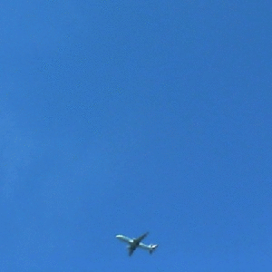
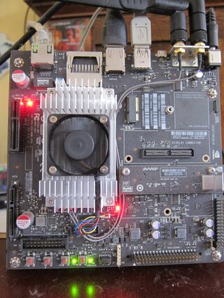

# SkyWatcher
**An automated aircraft annotation system for my backyard.. or anywhere really**



## Description
SkyWatcher is designed to do one thing: Automate the task of capturing aircraft images along with annotations. Why? Firstly, I live in the approach path to MSP. Secondly, I love airplanes, and lastly I really like exploring robotics, machine learning and computer vision topics. The end goal is to be able to build a detector/classifier that can reliably determine what type of aircraft is being observed through visual recognition alone. To do that I need a lot of training samples and although I'm no stranger to hand annotation (https://github.com/froohoo/Inference) I didn't really want to do that again. Plus I have always been intrigued by opportunites to automate the generation of high quality training annotated data.


## Requirements

```
On server / listening node:
----------------------------
certifi==2019.3.9
chardet==3.0.4
idna==2.8
numpy==1.16.3
opencv==3.4.0
pkg-resources==0.0.0
requests==2.21.0
SQLAlchemy==1.3.3
toml==0.10.0
urllib3==1.24.3

Symbolic link in working directory to:
------------------------------
MobileNetSSD_deploy.caffemodel
MobileNetSSD_deoply.prototxt.txt

Symbolic link in working directory to aircraft database such as found at:
-------------------------------
http://opensky-network.org/datasets/metadata

On streaming /pi camera node:
----------------------------
ffpmeg-python==0.1.17
future==0.17.1
```

## Running
The skyWatcher.toml file should be updated, at a mimimum to specify your geofence, and a location where the image files and annotations will be written to. If you don't know the  lattitude and longitude of your geofence, they can be read on google maps by right clicking the map and selecting 'what's here'. Otherwise, the annotater will be searching for air traffic in the wrong location...probably mine. Everything else can be pretty much left as is unless you have an open-sky api key you want to use, which comes with the benifit of more precisision and historical lookups.

watcher.py is run on the node with the camera (raspberry pi in my case) and is launched by specifying the IP and port of the listening node, for example: 
``` ./watcher.py -s 10.42.0.1 -p 5555 ```

On the listening node, the image processing/annotation processes are started as follows, assuming the skyWatcher.toml is correctly configured and symbolic links to the MobileNetSSD and aircraft database are set:
``` ./listner.py```

Listner prints the source image shape, and crop bounding box coordinates when it gets images from the watcher node. 

## Description of Operation

### Capture Video (Step 1)
SkyWatcher's video capture setup is based in large part on the excellent tutorial provided by Adrian Rosebrock [located here](https://www.pyimagesearch.com/2019/04/15/live-video-streaming-over-network-with-opencv-and-imagezmq/). ~~It uses ØMQ to transport images captured by a raspberry pi zero W.~~ I liked the zero W  for this project because it is cheap ($5 at Micro Center) and I already had a webcam to use with it. For my setup, I assembled everything into a used Ferro Rocher chocolate box ($7.39 at Target). Bonus: You get to eat the chocoloates inside. Everything is precision attached with hot glue. Originally, I levereraged the ØMQ+OpenCV package used in the tutorial, but have sinced migrated to use a simple jpeg socket stream leveraging ffmpeg.I did like the feature that included embedding the host name in the jpeg's though so each jpeg is modified to include a jpeg COM(COMMENT) field which now holds that data. Two reasons for changing this: I can now get up to 15FPS from the camera since ffmpeg reads the native JPEG stream from the camera, where before with opencv/zeroMQ I was capped at ~ 2FPS. Additionally, raspian comes with FFMPEG installed so there is very little needed on the PI. I chose to use the ffmpeg-python wrapper but this could be easily swapped out for a simple bash script. 
. Video is currently captured at 800x600 due to the slowdown in capturing at higher resolutions. At this resolution I get about 1-2 FPS. ~~It is possible that using a ribbon connected dedicated pi camera would help here, but I already owned this webcam, and I don't have a job, so doing this as cost effectively as possible is one of the goals.  Network signal strength also has a huge impact on FPS.~~ ~~After doing some profiling, the low FPS is almost entirely due to the way zeroMQ is currently implemented. Need to either optimize or move away entirely from zmq in a future version.~~ After rewriting the listner to recieve ffmpeg jpeg over sockets I can now get 3fps reliably, but the bigger issue now seems to be with openCV's dnn and background segmentation, specifically that they do not include GPU support; so the Jetson TX2's main advantage is currently underutilized. Might need to implement the dnn forward pass directly in cudadnn at some point...

v4l2-ctl is used to disable autofocus and set the camera at infinity prior to capture for best results. No other image processing is done on the pi, although it does have some spare CPU overhead currently. However, since I have a jetson TX2 developer board, it made the most sense to do all the motion proceessing, forward network propogation, and annotation there. 




### Motion Detection & Cropping (Step 2)
Even though I live in the approach path, and the aircraft on approach appear huge, they only occupy a small portion of the image frame. 


The MobileNet-SSD detector takes 300x300 images, so a couple options were available. I could modify the input layer to accept a larger image but it didn't seem to make sense to add all those extra parameters when most of the images were just empty sky. I could have resized the images, either ahead of time or as part of the data augmentation layers of the network, but that would lose much of the detail within the region of interest. So instead, I settled on background segmentation and implemented a simple, but adequate motion tracker to identify the ROI, and then extract it as a 300x300 crop of the original image. Cropping is done by finding the center of a bounding box encompassing all the pixels with detected motion,and then cropping a 300x300 image from it's center. As a result, a crop from the above image that would be fed into the MobileNet-SSD is shown below. Note that the moving plane is off center because it is near the edge and while I could have implemented a 'same-padding' approach to the cropping, I instead chose to shift the crop center for motion at edges.


### Forward Pass through MobileNet-SSD for detection of Aircraft (Step 3)
The crop is fed through the pretrained MobileNet-SSD to find any aircraft in the cropped image. If a aircraft is found, the bounding box, along with the cropped image is placed on the queue of the annotation process so that the main routine can continue extracting crops and aircraft. A visual overview of everything working together (again, modified and repurposed from Adrian's tutorial) can be seen in the gif below for this example of an Minnesota Air National Guard C130 on approach. The black frame on the right displays the motion detection mask bitwise AND'd with the full frame. The mask is convlovled with a small errosion kernel to remove any point noise from the webcam sensor. This is a little heavy handed and delays the initial detection of the motion but the current Network can not successfully detect planes at that point anyway, so it would not have produced better results at this stage in the project.


### Annotation (Step 4)
The annotation process runs in a separate instance and accepts detection objects on its queue that consist of the cropped image and the bounding box returned by the MobileNet-SSD. However, I want to annotate these images with as much of the make/model/registration data as possible. To do this, I leverage the opensky-network.org REST API to perform a geofence query for aircraft over my house. Unlike Flightaware, which I also like, opensky-network offers the ability to do geofence queries, and anonomous REST calls. Can't say enough good things about their service, it relies on volunteer crowd sourced ADS-B transponder message collection that is aggregated at their site. Succesful opensky queries will return a json object similar to this: ```[['a091f3', 'EDV5236 ', 'United States', 1557752329, 1557752329, -93.3005, 44.9273, 662.94, False, 77.62, 123.37, -4.55, None, 647.7, '3745', False, 0]]``` For my purposes I am only interested in the first member which is the icao24 transponder code for the aircraft (for details on their whole api, [see here](https://opensky-network.org/apidoc) ). The icao24 identifier is a 24bit hex string unique to each aircraft and is often a hash of its registration number. I could not locate any services that would provide an aircraft registration REST interface but opensky also offers download of their entire registration database(updated daily) in csv format. This db is available in other locations, like from the FAA/NTSB but I found opensky's to be the simplest to use because it is just one file unlike the FAA's multi-table download. 

Assuming the opensky query returned a icao24 identifier, the annotater does a local lookup of the in memory registration database (~ 500,000 rows) and returns the registration details associated with that transponder. The annotation, along with the bounding box for the aircraft, are stored in a toml file with the same numbering convention as the aircraft image. I chose TOML because there are so many different annotation formats already that trying to adehere to an XML, KITTI or other annotation standard just didn't seem worth the effort since I'll likely have do do some preprocessing on it anyway.. and TOML is just so simple to use and read. A sample of a TOML annotation for the previous aircraft detection is shown here:
```
bb = [ "133", "182", "164", "199",]
imagename = "/home/nvidia/airplanes/1107.jpg"

[record]
operatorcallsign = "DELTA"
firstflightdate = ""
serialnumber = "55026"
acars = "false"
notes = ""
testreg = ""
owner = "Wells Fargo Trust Co Na Trustee"
registration = "N965AT"
icaoaircrafttype = "L2J"
manufacturername = "Boeing"
model = "717-200"
registered = ""
operatoriata = ""
operatoricao = "DAL"
status = ""
adsb = "false"
seatconfiguration = ""
operator = ""
icao24 = "ad6ecb"
engines = "BMW ROLLS BR 700 SERIES"
reguntil = "2021-04-30"
categoryDescription = ""
id = 358359
linenumber = ""
manufacturericao = "BOEING"
built = "2001-01-01"
typecode = "B712"
modes = "false"
```


